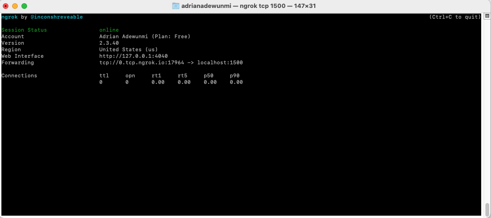
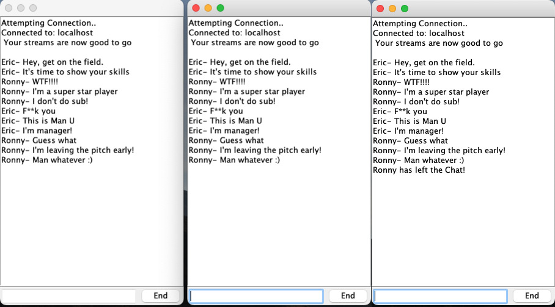

# Project Title: 

A Java Chat Messenger Application.

## 1. Project Description:

A Chat Messenger Application, built using Java 8, and Java Swing for GUI. 

In addition, it supports Ngrok and Multirun functionality.

## 2. Tech Stack:

* Language - Java 8
* IDE - Intellij (Plugin Multirun)
* API - Ngrok (Port Forwarding System)

## 3. Install Project:

i. Clone the git repo

```
https://github.com/AAdewunmi/Swing_Chat_Messenger_Application.git
```

ii. Open project folder

iii. Explore


## 4. Register and Install Ngrok (Global, OSX):


i. Installing ngrok on OSX (Read Ngrok documentation and Github Gist below):

https://ngrok.com/docs/getting-started

https://gist.github.com/wosephjeber/aa174fb851dfe87e644e


ii. Access Ngrok TCP tunnel using Terminal: 

Run > $ ngrok tcp 2020

> TERMINAL ERROR MESSAGE!

TCP tunnels are only available after you sign up.
Sign up at: https://dashboard.ngrok.com/signup

If you have already signed up, make sure your authtoken is installed.
Your authtoken is available on your dashboard: https://dashboard.ngrok.com/get-started/your-authtoken 

Run > $ ngrok authtoken [TOKEN]

Re-Run > $ ngrok tcp 2020



iii. Use Ngrok as a service in Intellij IDE (YouTube Video):

https://www.youtube.com/watch?v=eMt29lTPh8I

## 5. How To Use:

i. Run Server Class, then Client Class.

ii. Run Server and *** multiple Client configs on "localhost"/Port Number 2020.

iii. Run Server and *** multiple Client configs on Ngrok-as-a-service (Download plugin) on "localhost"/Port Number 2020.

iv. Run Server and *** multiple Client configs on Multirun-as-a-service (Download plugin) on "localhost"/Port Number 2020.

v. Run Server config on "localhost"/Port 2020, Run multiple *** Client configs using NGROK forwarding service (See commented code in Client and Server Class). Sample Ngrok forwarding address: "x.tcp.ngrok.io", port number XXXXX.

* multiple Client configs: To create multiple clients using Intellij, you need to go to 
-> Edit Configurations
-> Click Client
-> Copy Configuration
-> Client(1) created. This process can be repeated to create as many clients as required.


## 6. Demo (Chat Screenshot):



## 7. Contribution:

Pull requests are welcome. For major changes, please open an issue first to discuss what you would like to change.

## 8. Adapted from:

UDEMY: Java Development Mega Course: Build Projects Practically

(Java Programming Course: Learn Development of JAVA Projects Using JSP, JDBC, Servlets, Swing, Spring Boot, Maven, Hibernate)

Project Name: Project 38: TCP Chat Application

Created by: Engineering.Org.In

Last updated: 03/2022

URL: https://www.udemy.com/course/build-real-world-java-projects-using-spring-jsp-jdbc/
